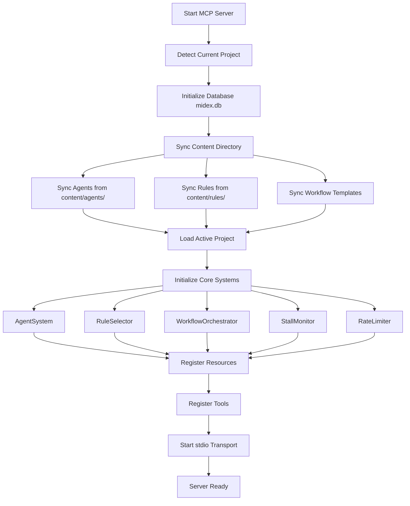
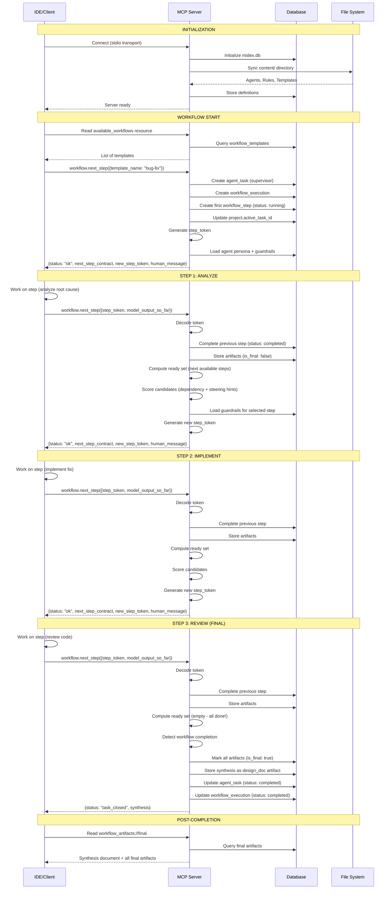
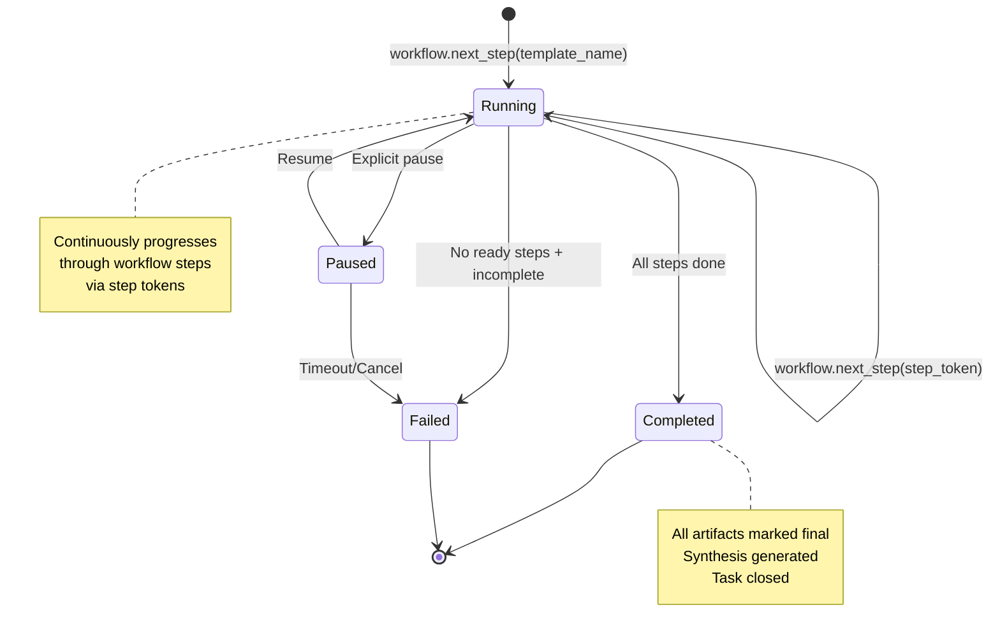
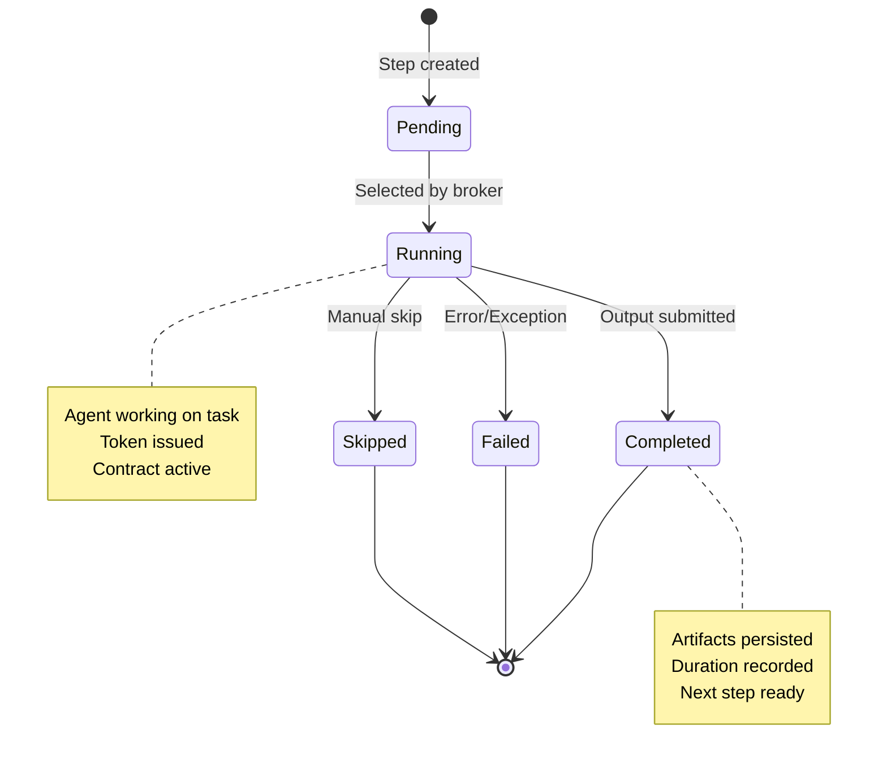
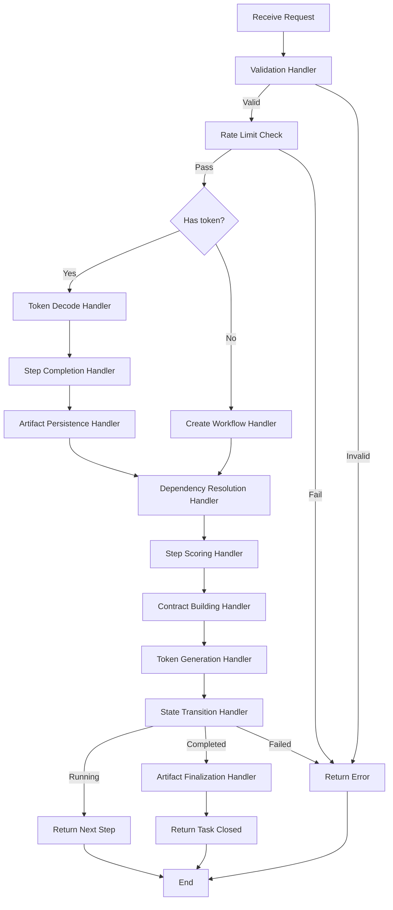
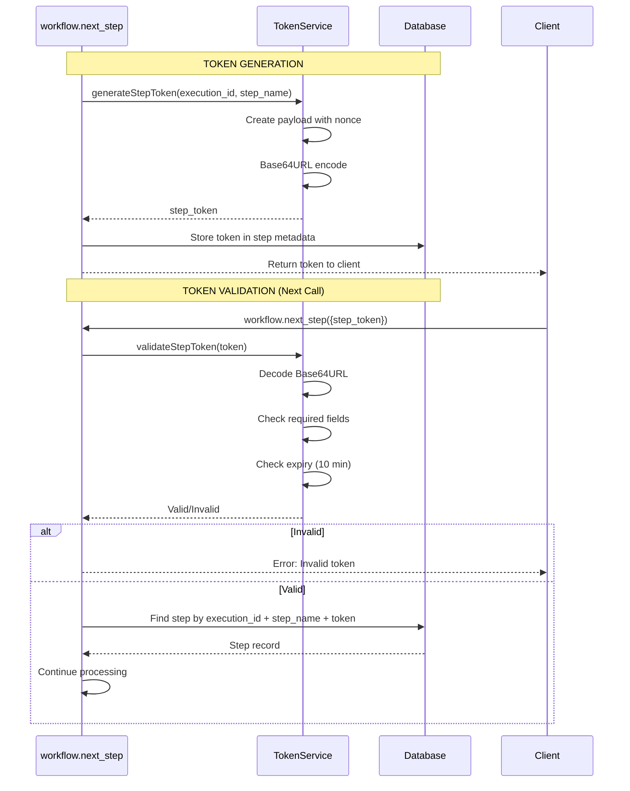
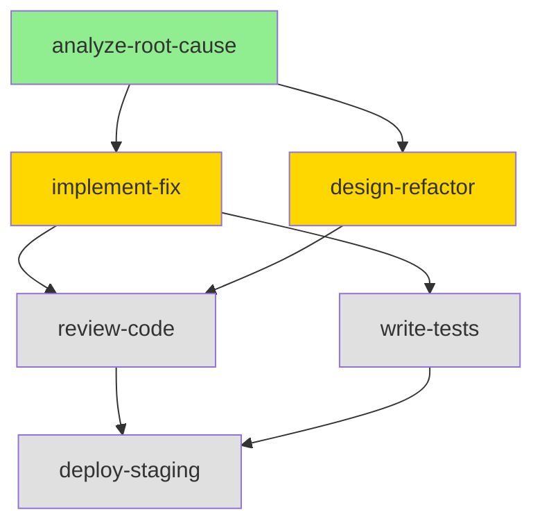
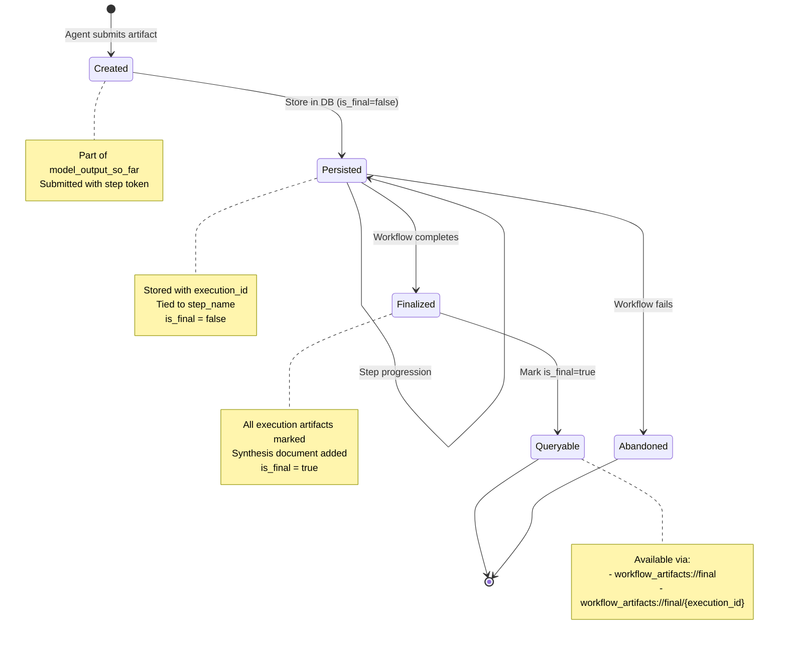

# MCP-Based Workflow Orchestration System

> **Version**: 3.1.0 (Resources-First Architecture)
> **Status**: Production
> **Last Updated**: 2025-11-20

## Table of Contents

1. [Overview](#overview)
2. [Architecture Principles](#architecture-principles)
3. [MCP Server Setup](#mcp-server-setup)
4. [Resources (Read Operations)](#resources-read-operations)
5. [Tools (Write Operations)](#tools-write-operations)
6. [Workflow Execution Flow](#workflow-execution-flow)
7. [Token-Based State Management](#token-based-state-management)
8. [Dependency Resolution & Step Selection](#dependency-resolution--step-selection)
9. [Guardrails & Safety](#guardrails--safety)
10. [Artifact Lifecycle](#artifact-lifecycle)
11. [Rate Limiting & Stall Detection](#rate-limiting--stall-detection)
12. [Database Schema](#database-schema)
13. [Implementation Details](#implementation-details)

---

## Overview

The MCP (Model Context Protocol) Workflow Orchestration System is a sophisticated agent coordination framework built on a **resources-first architecture**. It enables multi-step, multi-agent workflows with:

- **Single unified tool** (`workflow.next_step`) for all write operations
- **7 read-only resources** providing context (IDE-cacheable, subscribable)
- **Token-based state machine** for deterministic step progression
- **Parallel dependency resolution** with intelligent step selection
- **Comprehensive artifact management** with synthesis generation
- **Rate limiting** and **stall detection** for reliability

### Design Philosophy

```
Resources (READ) → Provide Context
   ↓
Tool (WRITE) → Drive Progression
   ↓
Database → Persist State
   ↓
Artifacts → Capture Knowledge
```

**Key Innovation**: All workflow orchestration decisions flow through a single broker tool (`workflow.next_step`), while resources provide rich context without side effects.

---

## Architecture Principles

### Resources-First Design (v3.1.0)

#### Resources (READ Operations)

- **Purpose**: Provide context without state changes
- **Caching**: IDE can cache for optimal performance
- **Subscriptions**: Real-time updates available
- **Auto-cleanup**: Invalid state automatically cleaned
- **Zero side effects**: Pure read operations

#### Tools (WRITE Operations)

- **Purpose**: Execute workflow progression only
- **Transactional**: All-or-nothing semantics
- **Broker-controlled**: Single decision point
- **Validation**: Input validation with Zod schemas
- **Telemetry**: Comprehensive logging and metrics

### Benefits

1. **IDE Caching**: Resources cached client-side, reducing redundant calls
2. **Subscriptions**: Real-time workflow updates without polling
3. **Clarity**: Single tool for all state changes
4. **Performance**: Separate read/write optimization paths
5. **Safety**: No lock contention, guaranteed idempotency for resources

---

## MCP Server Setup

### Initialization Flow



### Core Systems

| System | Purpose | File Location |
|--------|---------|---------------|
| **ResourceHandlers** | 7 read-only resources for workflow context | `server/mcp/resources/index.ts` |
| **ToolHandlers** | 2 tools for workflow control (start, next_step) | `server/mcp/tools/index.ts` |
| **WorkflowStateMachine** | State transitions and execution tracking | `server/mcp/core/workflow-state-machine.ts` |
| **StepExecutor** | Step progression and token management | `server/mcp/core/step-executor.ts` |
| **TokenService** | Token generation and validation | `server/mcp/core/token-service.ts` |

### Entry Point

```typescript
// server/mcp/server.ts

const server = new Server(
  { name: 'midex-mcp', version: '2.0.0' },
  { capabilities: { resources: {}, tools: {} } }
);

// Initialize database and handlers
const db = await initDatabase();
const resourceHandlers = new ResourceHandlers(db);
const toolHandlers = new ToolHandlers(db);

// Register resource and tool handlers
server.setRequestHandler(ListResourcesRequestSchema, ...);
server.setRequestHandler(ReadResourceRequestSchema, ...);
server.setRequestHandler(ListToolsRequestSchema, ...);
server.setRequestHandler(CallToolRequestSchema, ...);

// Start server
const transport = new StdioServerTransport();
await server.connect(transport);
```

### Server Configuration

```json
// Example: .cursor/mcp.json or ~/.claude.json
{
  "mcpServers": {
    "midex": {
      "command": "node",
      "args": ["/absolute/path/to/server/dist/mcp/server.js"],
      "transport": "stdio"
    }
  }
}
```

---

## Resources (Read Operations)

All resources are **pure read operations** with **no side effects**. They are:

- **IDE-cacheable** for performance
- **Subscribable** for real-time updates
- **Auto-cleaning** invalid state

### 1. `persona` Resource

**URI**: `persona://default` or `persona://{agent_name}`

**Purpose**: Provides the agent's full persona and capabilities.

**Selection Logic**:
1. Requested agent if specified
2. Default to "supervisor" agent
3. Any active agent from database

**Returns**: Full markdown content from `content/agents/{name}.md`

```markdown
# Supervisor Agent

**Role**: Multi-agent workflow orchestration and coordination

## Capabilities
- Workflow template selection
- Agent task delegation
- Progress monitoring
- Conflict resolution

## Guidelines
- Prefer parallel execution when possible
- Validate dependencies before delegation
- Monitor for stalls and blockers
...
```

**Use Case**: Agent context for understanding its role in the workflow.

---

### 2. `guardrails` Resource

**URI**: `guardrails://active`

**Purpose**: Provides active rules and forbidden actions.

**Selection Logic**:
- Universal rules with `always_apply: true` (highest priority)
- Tool-specific rules matching current context
- Any active rules from database

**Returns**: Markdown-formatted concatenation of all relevant rule content.

```markdown
# Active Guardrails

## Rule: Security Best Practices

- **NEVER** commit secrets, API keys, or credentials
- **NEVER** use eval() or exec() on user input
- **ALWAYS** validate and sanitize inputs
- **VALIDATE** all file paths before operations
- **PROTECT** sensitive data with encryption

## Rule: Code Quality Standards

- **ALWAYS** write unit tests for new functions
- **NEVER** push directly to main/master branch
- **MUST** follow TypeScript strict mode
...
```

**Use Case**: Safety constraints for agent operations.

---

### 3. `current_step` Resource

**URI**: `current_step://{task_id}` (optional task_id, defaults to project's active_task_id)

**Purpose**: Returns the current workflow step with contract and artifacts.

**Returns**: JSON object with current step details.

```json
{
  "execution_id": "a1b2c3d4-...",
  "status": "running",
  "progress": 40,
  "current_step": "implement-fix",
  "artifacts": [
    {
      "id": 123,
      "artifact_id": "e5f6g7h8-...",
      "type": "implementation_plan",
      "title": "Bug Fix Implementation Plan",
      "step_name": "implement-fix",
      "agent_name": "implementer",
      "content": "# Implementation Plan\n\n## Root Cause\n...",
      "created_at": "2025-11-20T10:30:00.000Z"
    }
  ]
}
```

**Use Case**: Quick progress tracking and context for current step (lossless handoff).

---

### 4. `workflow_status` Resource

**URI**: `workflow_status://{task_id}` (optional task_id)

**Purpose**: Returns complete execution history with all steps and artifacts.

**Returns**: JSON object with full workflow state.

```json
{
  "execution_id": "a1b2c3d4-...",
  "status": "running",
  "current_step": "review-code",
  "progress": 75,
  "steps": [
    {
      "step_name": "analyze-root-cause",
      "status": "completed",
      "agent_name": "debugger",
      "started_at": "2025-11-20T10:00:00.000Z",
      "completed_at": "2025-11-20T10:15:00.000Z",
      "artifacts": [
        {
          "id": 120,
          "type": "design_doc",
          "title": "Root Cause Analysis",
          "content": "...",
          "created_at": "2025-11-20T10:15:00.000Z"
        }
      ]
    },
    {
      "step_name": "implement-fix",
      "status": "completed",
      "agent_name": "implementer",
      "started_at": "2025-11-20T10:15:00.000Z",
      "completed_at": "2025-11-20T10:30:00.000Z",
      "artifacts": [...]
    },
    {
      "step_name": "review-code",
      "status": "running",
      "agent_name": "reviewer",
      "started_at": "2025-11-20T10:30:00.000Z",
      "artifacts": []
    }
  ]
}
```

**Use Case**: Full audit trail and state inspection.

---

### 5. `project_context` Resource

**URI**: `project_context://{project_id}`

**Purpose**: Returns current project info with active task.

**Auto-cleanup**: Validates `active_task_id` and clears if invalid.

**Returns**: JSON object with project and task details.

```json
{
  "project": {
    "id": 1,
    "name": "my-app",
    "path": "/home/user/my-app",
    "tech_stack": ["typescript", "nodejs", "react"],
    "architecture_pattern": "monorepo"
  },
  "active_task": {
    "task_id": "a1b2c3d4-...",
    "workflow": "bug-fix",
    "status": "active",
    "current_step": "review-code",
    "progress": 75,
    "last_activity": "2025-11-20T10:30:00.000Z"
  }
}
```

**Use Case**: Quick project state without full workflow history.

---

### 6. `available_workflows` Resource

**URI**: `available_workflows://all`

**Purpose**: Returns all workflow templates with metadata.

**Returns**: JSON array of workflow templates.

```json
{
  "workflows": [
    {
      "name": "bug-fix",
      "description": "Debug and fix production issues",
      "type": "sequential",
      "steps_count": 5,
      "estimated_duration_minutes": 30,
      "tags": ["critical", "incident-response"]
    },
    {
      "name": "feature-implementation",
      "description": "Implement new features with full design process",
      "type": "hybrid",
      "steps_count": 8,
      "estimated_duration_minutes": 120,
      "tags": ["development", "design"]
    }
  ]
}
```

**Use Case**: Workflow discovery and planning.

---

### 7. `workflow_artifacts` Resource

**URI Patterns**:

```
workflow_artifacts://recent?limit=50                    # Recent artifacts
workflow_artifacts://type/design_doc?limit=100          # By type
workflow_artifacts://final                              # Final artifacts only
workflow_artifacts://final/{execution_id}               # Final for execution
workflow_artifacts://{execution_id}                     # All for execution
workflow_artifacts://{execution_id}?final=true          # Final for execution
```

**Purpose**: Queryable artifact resource for knowledge retrieval.

**Returns**: JSON object with artifacts.

```json
{
  "artifacts": [
    {
      "id": 456,
      "artifact_id": "x9y8z7w6-...",
      "execution_id": "a1b2c3d4-...",
      "step_name": "implement-fix",
      "agent_name": "implementer",
      "type": "implementation_plan",
      "title": "Bug Fix Implementation",
      "content": "# Implementation Plan\n\n...",
      "is_final": true,
      "created_at": "2025-11-20T10:30:00.000Z",
      "content_size_bytes": 4096
    }
  ],
  "total": 15,
  "query": {
    "type": "execution",
    "execution_id": "a1b2c3d4-...",
    "is_final": true,
    "limit": 100
  }
}
```

**Use Case**: Artifact discovery, synthesis documents, past results.

---

## Tools (Write Operations)

### Single Unified Tool: `workflow.next_step`

**Purpose**: The **entire broker** for workflow orchestration. Handles:

1. Workflow creation (when `template_name` provided)
2. Step progression (when `step_token` provided)
3. Workflow completion and synthesis
4. State validation and cleanup

**Location**: `server/mcp/tools/index.ts` (ToolHandlers class)

---

### Input Schema

```typescript
interface NextStepRequest {
  // --- WORKFLOW CREATION ---
  template_name?: string;                    // e.g., "bug-fix"

  // --- WORKFLOW CONTINUATION ---
  step_token?: string | null;                // Token from previous step
  request: 'continue';                       // Always "continue"

  // --- STEP OUTPUT (only on continuation) ---
  model_output_so_far?: {
    // Required fields
    summary: string;                         // Executive summary
    artifacts: Array<{
      type: 'design_doc' | 'implementation_plan' | 'code_review' |
            'api_contract' | 'adr' | 'test_plan' | 'security_analysis' |
            'performance_analysis' | 'data_model' | 'diagram' |
            'markdown' | 'yaml' | 'json';
      title: string;
      content: string;
      description?: string;
      metadata?: object;
    }>;
    references: string[];                    // Files/docs referenced
    confidence: number;                      // 0-1 confidence score

    // Optional structured data
    decisions?: Array<{
      decision: string;
      rationale: string;
      alternatives_rejected: string[];
      trade_offs: string;
      context?: string;
    }>;
    findings?: Array<{
      severity: 'critical' | 'high' | 'medium' | 'low';
      category: string;
      description: string;
      location?: string;
      recommendation: string;
      impact?: string;
    }>;
    next_steps?: string[];
    blockers?: string[];
    metadata?: object;
  };

  // --- STEERING INPUTS (optional) ---
  requested_step_name?: string;              // Request specific step
  intent_tags?: string[];                    // Task tags for routing
  referenced_paths?: string[];               // Files being worked on
  rationale?: string;                        // Why this step/approach

  // --- LEGACY ---
  task_id?: string;                          // Resolved from project.active_task_id
}
```

---

### Output Schema

```typescript
interface NextStepResponse {
  status: 'ok' | 'no_op' | 'task_closed' | 'error';

  // Only on 'ok' status
  next_step_contract?: {
    step_name: string;                       // e.g., "implement-fix"
    allowed_actions: string[];               // What agent CAN do
    forbidden_actions: string[];             // What agent CANNOT do
    required_output_format: string;          // Expected output description
    human_gate_required: boolean;            // Needs human approval
  };

  new_step_token?: string;                   // Token for next call
  human_message?: string;                    // Instructions for agent

  // Only on 'task_closed' status
  synthesis?: {
    outcome_summary?: string;                // Final result narrative
    model_output?: any;                      // Structured final output
  };
}
```

---

## Workflow Execution Flow

### Complete Lifecycle Diagram



---

### Workflow State Machine



---

### Step Execution State Machine



---

### Handler Pipeline

The `workflow.next_step` tool uses a sequential handler pipeline:



---

## Token-Based State Management

### Token Structure

```typescript
interface StepTokenPayload {
  execution_id: string;        // UUID of workflow execution
  step_name: string;           // Name of step this token represents
  issued_at: number;           // Unix timestamp (ms) of issuance
  nonce: string;               // UUID for uniqueness
}
```

**Encoding**: Base64URL-encoded JSON

**Example Token**:
```
eyJleGVjdXRpb25faWQiOiJhMWIyYzNkNC1lNWY2LWc3aDgtaTlqMC1rMWwybTNuNG81cDYiLCJzdGVwX25hbWUiOiJpbXBsZW1lbnQtZml4IiwiaXNzdWVkX2F0IjoxNzAwMDAwMDAwMDAwLCJub25jZSI6Ing5eTh6N3c2LXY1dTQtdDNzMi1yMXExLXAwbzluOG03bDZrNSJ9
```

### Token Lifecycle



### Token Security

| Feature | Status | Notes |
|---------|--------|-------|
| **Expiration** | ✅ Implemented | 10 minutes hardcoded |
| **Signing** | ❌ Not implemented | Currently unsigned (TODO: JWT) |
| **Single-use** | ⚠️ Partial | Validated at DB level, not enforced |
| **Revocation** | ❌ Not implemented | TODO: Add revocation list |
| **Nonce** | ✅ Implemented | UUID included in payload |

**Security Recommendations**:
1. Add JWT signing with HS256 or RS256
2. Implement database-backed revocation list
3. Enforce single-use at application level
4. Add token refresh mechanism for long workflows

---

## Dependency Resolution & Step Selection

### Dependency Graph



**Legend**:
- 🟢 Green: Completed
- 🟡 Yellow: Ready (all dependencies met)
- ⚪ Gray: Pending (waiting on dependencies)

---

### Ready Set Computation

**Algorithm** (`src/domain/workflows/next-step-broker.ts`):

```typescript
function computeReadySet(
  steps: WorkflowStep[],
  completed: Set<string>,
  running: Set<string> = new Set()
): WorkflowStep[] {
  return steps.filter(step => {
    // Skip if already completed or running
    if (completed.has(step.name) || running.has(step.name)) {
      return false;
    }

    // Include if no dependencies
    if (!step.dependencies || step.dependencies.length === 0) {
      return true;
    }

    // Include if ALL dependencies completed
    return step.dependencies.every(dep => completed.has(dep));
  });
}
```

**Example**:

Given workflow steps:
```json
[
  { "name": "analyze-root-cause", "dependencies": [] },
  { "name": "implement-fix", "dependencies": ["analyze-root-cause"] },
  { "name": "design-refactor", "dependencies": ["analyze-root-cause"] },
  { "name": "review-code", "dependencies": ["implement-fix", "design-refactor"] }
]
```

Progress:
```
Step 1: completed = []
  → ready = ["analyze-root-cause"]
  → Select: "analyze-root-cause"

Step 2: completed = ["analyze-root-cause"]
  → ready = ["implement-fix", "design-refactor"]
  → PARALLEL OPPORTUNITY!
  → Select: "design-refactor" (alphabetical)

Step 3: completed = ["analyze-root-cause", "design-refactor"]
  → ready = ["implement-fix"]
  → Select: "implement-fix"

Step 4: completed = ["analyze-root-cause", "design-refactor", "implement-fix"]
  → ready = ["review-code"]
  → Select: "review-code"

Step 5: completed = all steps
  → ready = []
  → WORKFLOW COMPLETE
```

---

### Scoring Algorithm

```typescript
function scoreParallelCandidates(
  candidates: WorkflowStep[],
  hints: SteeringHints = {},
  context: SelectionContext = {}
): SelectionResult {
  const scores: Record<string, number> = {};

  for (const step of candidates) {
    let score = 0;

    // 1. EXPLICIT REQUEST (highest priority)
    if (hints.requested_step_name === step.name) {
      score += 999;
    }

    // 2. PATH MATCHING
    if (hints.referenced_paths) {
      const matches = step.pathPatterns?.filter(pattern =>
        hints.referenced_paths!.some(path => minimatch(path, pattern))
      ).length || 0;
      score += matches * 2;
    }

    // 3. TAG MATCHING
    if (hints.intent_tags) {
      const matches = step.tags?.filter(tag =>
        hints.intent_tags!.includes(tag)
      ).length || 0;
      score += matches * 1;
    }

    // 4. FOCUS PATHS (from context)
    if (context.focus_paths) {
      const matches = step.pathPatterns?.filter(pattern =>
        context.focus_paths!.some(path => minimatch(path, pattern))
      ).length || 0;
      score += matches * 1;
    }

    // 5. AGENT AFFINITY
    if (context.current_agent && step.agent_name === context.current_agent) {
      score += 1;
    }

    // 6. LAST USER CHOICE
    if (context.last_user_choice === step.name) {
      score += 3;
    }

    scores[step.name] = score;
  }

  // SORT BY SCORE (desc), then ALPHABETICALLY
  const sorted = candidates.sort((a, b) => {
    const scoreDiff = scores[b.name] - scores[a.name];
    if (scoreDiff !== 0) return scoreDiff;
    return a.name.localeCompare(b.name);  // Alphabetical tie-break
  });

  return {
    chosen: sorted[0],
    scores,
    reason: explainSelection(sorted[0], scores, hints),
    all_candidates: candidates.map(s => s.name),
    parallel_opportunities: candidates.map(s => s.name),
    tie_broken_by: scores[sorted[0].name] === scores[sorted[1]?.name] ? 'alphabetical' : 'none'
  };
}
```

**Scoring Weights**:

| Factor | Weight | Example |
|--------|--------|---------|
| Explicit request | +999 | `requested_step_name: "implement-fix"` |
| Path match | +2 each | `referenced_paths: ["src/auth.ts"]` |
| Tag match | +1 each | `intent_tags: ["security"]` |
| Focus path | +1 each | Context from previous steps |
| Agent affinity | +1 | Same agent as last step |
| User choice | +3 | Previously selected by user |

**Tie-breaking**: Alphabetical order by step name.

---

## Guardrails & Safety

### Guardrail Parsing

**Source**: Active rules from database (universal + tool-specific)

**Patterns Extracted**:

```typescript
interface ParsedGuardrails {
  forbidden_actions: string[];        // NEVER, PROTECT patterns
  required_actions: string[];         // ALWAYS, MUST patterns
  validation_requirements: string[];  // VALIDATE patterns
  source_rules: string[];             // Rule names
}
```

**Extraction Logic** (`src/domain/workflows/guardrails-parser.ts`):

```typescript
function parseGuardrails(rulesContent: Array<{ name: string; content: string }>): ParsedGuardrails {
  const forbidden = [];
  const required = [];
  const validation = [];

  for (const rule of rulesContent) {
    const lines = rule.content.split('\n');

    for (const line of lines) {
      // FORBIDDEN: - **NEVER** ...
      if (/- \*\*NEVER\*\*/.test(line)) {
        forbidden.push(extractAction(line));
      }

      // FORBIDDEN: - **PROTECT** ...
      if (/- \*\*PROTECT\*\*/.test(line)) {
        forbidden.push(extractAction(line));
      }

      // REQUIRED: - **ALWAYS** ...
      if (/- \*\*ALWAYS\*\*/.test(line)) {
        required.push(extractAction(line));
      }

      // REQUIRED: - **MUST** ...
      if (/- \*\*MUST\*\*/.test(line)) {
        required.push(extractAction(line));
      }

      // VALIDATION: - **VALIDATE** ...
      if (/- \*\*VALIDATE\*\*/.test(line)) {
        validation.push(extractAction(line));
      }
    }
  }

  return { forbidden_actions: forbidden, required_actions: required, validation_requirements: validation, source_rules: rulesContent.map(r => r.name) };
}
```

---

### Critical Action Prioritization

**Purpose**: Limit step contract to top 5 most critical forbidden actions.

**Priority Keywords** (descending importance):

| Category | Keywords | Weight |
|----------|----------|--------|
| **Secrets** | secret, credential, password, token, key | HIGH |
| **Destructive** | delete, drop, truncate, destroy | HIGH |
| **Execution** | eval, exec, execute | HIGH |
| **Deployment** | push, deploy, production | MEDIUM |
| **Version Control** | commit, permission | MEDIUM |

**Algorithm**:

```typescript
function getTopForbiddenActions(parsed: ParsedGuardrails, limit: number = 5): string[] {
  const priorityKeywords = {
    high: ['secret', 'credential', 'password', 'token', 'key', 'delete', 'drop', 'truncate', 'destroy', 'eval', 'exec', 'execute'],
    medium: ['push', 'deploy', 'production', 'commit', 'permission']
  };

  const scored = parsed.forbidden_actions.map(action => {
    let score = 0;
    const lower = action.toLowerCase();

    for (const keyword of priorityKeywords.high) {
      if (lower.includes(keyword)) score += 10;
    }

    for (const keyword of priorityKeywords.medium) {
      if (lower.includes(keyword)) score += 5;
    }

    return { action, score };
  });

  // Sort by score (desc), then alphabetically
  scored.sort((a, b) => {
    if (b.score !== a.score) return b.score - a.score;
    return a.action.localeCompare(b.action);
  });

  return scored.slice(0, limit).map(s => s.action);
}
```

---

### Step Contract

**Structure**:

```typescript
interface StepContract {
  step_name: string;                       // Current step name
  allowed_actions: string[];               // From workflow template
  forbidden_actions: string[];             // Top 5 from guardrails
  required_output_format: string;          // Expected output description
  human_gate_required: boolean;            // Needs human approval
}
```

**Example**:

```json
{
  "step_name": "implement-fix",
  "allowed_actions": [
    "Read source code files",
    "Analyze stack traces and error logs",
    "Propose code changes",
    "Create implementation plan artifact",
    "Reference external documentation"
  ],
  "forbidden_actions": [
    "NEVER commit secrets, API keys, or credentials",
    "NEVER use eval() or exec() on user input",
    "NEVER delete or truncate database tables",
    "NEVER push directly to main/master branch",
    "NEVER deploy to production without approval"
  ],
  "required_output_format": "Provide a summary of changes, implementation plan artifact with detailed code changes, list of files modified, confidence score, and any blockers.",
  "human_gate_required": false
}
```

**Usage in Instructions**:

```markdown
# Workflow Step: implement-fix

**Template**: bug-fix
**Agent Role**: implementer

## Your Task

[Task description from template]

## What You CAN Do
- Read source code files
- Analyze stack traces and error logs
- Propose code changes
- Create implementation plan artifact
- Reference external documentation

## What You CANNOT Do
- NEVER commit secrets, API keys, or credentials
- NEVER use eval() or exec() on user input
- NEVER delete or truncate database tables
- NEVER push directly to main/master branch
- NEVER deploy to production without approval

## Required Output Format

Provide a summary of changes, implementation plan artifact with detailed code changes, list of files modified, confidence score, and any blockers.

## Submitting Your Work

Call `workflow.next_step` with your model_output_so_far and the step_token provided.
```

---

## Artifact Lifecycle

### Artifact Types

```typescript
type ArtifactType =
  | 'design_doc'              // Design documents
  | 'implementation_plan'     // Implementation plans
  | 'code_review'             // Code review reports
  | 'api_contract'            // API specifications
  | 'adr'                     // Architecture Decision Records
  | 'test_plan'               // Test plans
  | 'security_analysis'       // Security assessments
  | 'performance_analysis'    // Performance reports
  | 'data_model'              // Data models
  | 'diagram'                 // Visual diagrams
  | 'markdown'                // Generic markdown
  | 'yaml'                    // YAML configuration
  | 'json';                   // JSON data
```

---

### Artifact State Diagram



---

### Artifact Persistence

**Handler**: `ArtifactStorageService` (`src/core/database/artifact-storage-service.ts`)

**Flow**:

```typescript
async function persistArtifacts(
  db: DatabaseInterface,
  artifacts: Artifact[],
  executionId: string,
  stepName: string,
  agentName: string
): Promise<void> {
  const records = artifacts.map(artifact => ({
    artifact_id: randomUUID(),
    execution_id: executionId,
    step_name: stepName,
    agent_name: agentName,
    artifact_type: artifact.type,
    title: artifact.title,
    content: artifact.content,
    description: artifact.description,
    is_final: false,
    metadata: artifact.metadata,
    content_size_bytes: Buffer.byteLength(artifact.content, 'utf8')
  }));

  // BEST-EFFORT: Don't fail workflow on artifact storage errors
  try {
    await db.createWorkflowArtifacts(records);
  } catch (error) {
    console.error('Failed to persist artifacts:', error);
    // Continue workflow even if artifact storage fails
  }
}
```

**Best-Effort Policy**:
- Artifact storage failures **do not fail the workflow**
- Logged for debugging
- Step progression continues regardless

---

### Artifact Finalization

**Handler**: `ArtifactCompletionService` (`src/core/database/artifact-completion-service.ts`)

**Triggered on**: Workflow completion (status: 'completed')

**Flow**:

```typescript
async function finalizeArtifacts(
  db: DatabaseInterface,
  executionId: string,
  synthesis: { outcome_summary?: string; model_output?: any }
): Promise<void> {
  // 1. Mark all execution artifacts as final
  await db.updateWorkflowArtifacts(
    { execution_id: executionId },
    { is_final: true }
  );

  // 2. Create synthesis artifact
  if (synthesis.outcome_summary) {
    await db.createWorkflowArtifact({
      artifact_id: randomUUID(),
      execution_id: executionId,
      step_name: null,              // Not tied to specific step
      agent_name: 'supervisor',     // Attributed to supervisor
      artifact_type: 'design_doc',
      title: 'Workflow Synthesis',
      content: synthesis.outcome_summary,
      description: 'Final synthesis of workflow execution',
      is_final: true,
      metadata: synthesis.model_output,
      content_size_bytes: Buffer.byteLength(synthesis.outcome_summary, 'utf8')
    });
  }
}
```

**Result**:
- All artifacts for execution marked `is_final: true`
- Synthesis document added as queryable artifact
- Available via `workflow_artifacts://final/{execution_id}`

---

### Artifact Querying

**Resource**: `workflow_artifacts`

**Query Types**:

#### 1. Recent Artifacts

```
URI: workflow_artifacts://recent?limit=50
```

Returns: Latest 50 artifacts (any execution, any type)

#### 2. Type-Filtered Artifacts

```
URI: workflow_artifacts://type/design_doc?limit=100
```

Returns: Up to 100 artifacts of type `design_doc`

#### 3. Execution Artifacts

```
URI: workflow_artifacts://{execution_id}
```

Returns: All artifacts for specific execution (final and non-final)

#### 4. Final Artifacts Only

```
URI: workflow_artifacts://final
URI: workflow_artifacts://final/{execution_id}
URI: workflow_artifacts://{execution_id}?final=true
```

Returns: Only artifacts with `is_final: true`

---

## Rate Limiting & Stall Detection

### Rate Limiting

**Algorithm**: Token bucket (database-backed)

**Implementation**: `src/domain/workflows/rate-limiter.ts`

#### Per-Task Rate Limit

- **Scope**: Each `agent_task` independently limited
- **Steady RPS**: 0.5 requests/second
- **Burst Tokens**: 3 tokens
- **Refill**: Linear (1 token every 2 seconds)

#### Per-Agent Rate Limit

- **Scope**: Each agent independently limited
- **Steady RPS**: 2 requests/second
- **Burst Tokens**: 10 tokens
- **Refill**: Linear (1 token every 0.5 seconds)

#### Database Schema

```sql
CREATE TABLE workflow_rate_limit_buckets (
  scope TEXT NOT NULL,           -- 'task' | 'agent'
  scope_key TEXT NOT NULL,       -- task_id or agent_name
  tokens REAL NOT NULL,          -- Current token count (float)
  last_refill INTEGER NOT NULL,  -- Unix timestamp (ms) of last refill
  steady_rps REAL NOT NULL,      -- Tokens per second
  burst_tokens INTEGER NOT NULL, -- Max tokens
  PRIMARY KEY (scope, scope_key)
);
```

#### Token Bucket Logic

```typescript
async function checkRateLimit(
  scope: 'task' | 'agent',
  key: string,
  steadyRps: number,
  burstTokens: number
): Promise<RateLimitResult> {
  // 1. Load or create bucket
  let bucket = await db.getRateLimitBucket(scope, key);
  if (!bucket) {
    bucket = { tokens: burstTokens, last_refill: Date.now(), steady_rps: steadyRps, burst_tokens: burstTokens };
    await db.createRateLimitBucket(scope, key, bucket);
  }

  // 2. Refill tokens (linear)
  const now = Date.now();
  const elapsed = (now - bucket.last_refill) / 1000;  // seconds
  const tokensToAdd = elapsed * bucket.steady_rps;
  bucket.tokens = Math.min(bucket.burst_tokens, bucket.tokens + tokensToAdd);
  bucket.last_refill = now;

  // 3. Check if token available
  if (bucket.tokens >= 1) {
    // Consume 1 token
    bucket.tokens -= 1;
    await db.updateRateLimitBucket(scope, key, bucket);
    return { allowed: true };
  } else {
    // Deny with retry-after
    const tokensNeeded = 1 - bucket.tokens;
    const retryAfterMs = (tokensNeeded / bucket.steady_rps) * 1000;
    return { allowed: false, reason: `Rate limit exceeded for ${scope}:${key}`, retry_after_ms: retryAfterMs };
  }
}
```

#### Rate Limit Response

```json
{
  "error": "Rate limit exceeded for task:a1b2c3d4-...",
  "retry_after_ms": 1500
}
```

---

### Stall Detection

**Purpose**: Detect workflows that haven't progressed in 30+ minutes.

**Implementation**: `src/domain/workflows/stall-detector.ts`

#### Background Monitor

```typescript
class StallMonitor {
  private interval: NodeJS.Timeout | null = null;

  start() {
    // Check every 60 seconds
    this.interval = setInterval(() => this.checkForStalls(), 60000);
  }

  stop() {
    if (this.interval) {
      clearInterval(this.interval);
      this.interval = null;
    }
  }

  private async checkForStalls() {
    // 1. Find all running workflows
    const running = await db.getWorkflowExecutions({ status: 'running' });

    for (const execution of running) {
      // 2. Check last activity
      const lastActivity = await db.getLastWorkflowActivity(execution.execution_id);
      const elapsedMinutes = (Date.now() - lastActivity) / 60000;

      // 3. If stalled > 30 minutes
      if (elapsedMinutes > 30) {
        // 4. Create error event (informational)
        await db.createConversationEvent({
          event_id: randomUUID(),
          execution_id: execution.execution_id,
          event_type: 'error_occurred',
          event_data: {
            message: 'Workflow appears stalled (>30 min). Options: summarize findings, request review, or skip this step.',
            elapsed_minutes: elapsedMinutes
          },
          created_at: new Date().toISOString()
        });

        // 5. Increment stall count in metadata
        const metadata = execution.metadata || {};
        metadata.stall_count = (metadata.stall_count || 0) + 1;
        await db.updateWorkflowExecution(execution.execution_id, { metadata });
      }
    }
  }
}
```

#### Stall Event

```json
{
  "event_id": "x9y8z7w6-...",
  "execution_id": "a1b2c3d4-...",
  "event_type": "error_occurred",
  "event_data": {
    "message": "Workflow appears stalled (>30 min). Options: summarize findings, request review, or skip this step.",
    "elapsed_minutes": 35
  },
  "created_at": "2025-11-20T11:00:00.000Z"
}
```

**Note**: Stall detection is **informational only**. It does not automatically fail workflows, but creates events for observability.

---

## Database Schema

### Core Tables

#### 1. `workflow_executions`

```sql
CREATE TABLE workflow_executions (
  execution_id TEXT PRIMARY KEY,
  template_id INTEGER NOT NULL,
  task_id TEXT NOT NULL,
  status TEXT NOT NULL,                    -- 'running'|'paused'|'completed'|'failed'
  current_step TEXT,
  progress INTEGER DEFAULT 0,              -- 0-100
  started_at TEXT NOT NULL,
  completed_at TEXT,
  duration_ms INTEGER,
  synthesis_output TEXT,
  time_saved_ms INTEGER,
  efficiency_score REAL,
  metadata TEXT,                           -- JSON: { stall_count, parallel_decision_count, ... }
  FOREIGN KEY (template_id) REFERENCES workflow_templates(id),
  FOREIGN KEY (task_id) REFERENCES agent_tasks(task_id)
);
```

#### 2. `workflow_steps`

```sql
CREATE TABLE workflow_steps (
  id INTEGER PRIMARY KEY AUTOINCREMENT,
  execution_id TEXT NOT NULL,
  step_name TEXT NOT NULL,
  agent_name TEXT NOT NULL,
  status TEXT NOT NULL,                    -- 'pending'|'running'|'completed'|'failed'|'skipped'
  started_at TEXT,
  completed_at TEXT,
  duration_ms INTEGER,
  outcome_summary TEXT,
  metadata TEXT,                           -- JSON: { token, model_output, contract, ... }
  FOREIGN KEY (execution_id) REFERENCES workflow_executions(execution_id)
);
```

#### 3. `workflow_artifacts`

```sql
CREATE TABLE workflow_artifacts (
  id INTEGER PRIMARY KEY AUTOINCREMENT,
  artifact_id TEXT UNIQUE NOT NULL,
  execution_id TEXT NOT NULL,
  step_name TEXT,                          -- NULL for synthesis artifacts
  agent_name TEXT,
  artifact_type TEXT NOT NULL,             -- 'design_doc'|'implementation_plan'|...
  title TEXT,
  content TEXT NOT NULL,
  description TEXT,
  is_final INTEGER DEFAULT 0,              -- 0 = false, 1 = true
  metadata TEXT,                           -- JSON
  created_at TEXT NOT NULL,
  content_size_bytes INTEGER,
  FOREIGN KEY (execution_id) REFERENCES workflow_executions(execution_id)
);

CREATE INDEX idx_artifacts_execution ON workflow_artifacts(execution_id);
CREATE INDEX idx_artifacts_final ON workflow_artifacts(is_final);
CREATE INDEX idx_artifacts_type ON workflow_artifacts(artifact_type);
```

#### 4. `agent_tasks`

```sql
CREATE TABLE agent_tasks (
  id INTEGER PRIMARY KEY AUTOINCREMENT,
  task_id TEXT UNIQUE NOT NULL,
  agent_name TEXT NOT NULL,
  project_id INTEGER NOT NULL,
  task_description TEXT NOT NULL,
  status TEXT NOT NULL,                    -- 'active'|'paused'|'completed'|'failed'
  created_at TEXT NOT NULL,
  updated_at TEXT NOT NULL,
  metadata TEXT,                           -- JSON: { template_name, referenced_paths, ... }
  FOREIGN KEY (agent_name) REFERENCES agents(name),
  FOREIGN KEY (project_id) REFERENCES projects(id)
);
```

#### 5. `projects`

```sql
CREATE TABLE projects (
  id INTEGER PRIMARY KEY AUTOINCREMENT,
  name TEXT NOT NULL UNIQUE,
  path TEXT NOT NULL UNIQUE,
  tech_stack TEXT,                         -- JSON array: ["typescript", "nodejs"]
  architecture_pattern TEXT,
  active_task_id TEXT,                     -- Current workflow task
  created_at TEXT NOT NULL,
  updated_at TEXT NOT NULL,
  FOREIGN KEY (active_task_id) REFERENCES agent_tasks(task_id)
);
```

#### 6. `workflow_rate_limit_buckets`

```sql
CREATE TABLE workflow_rate_limit_buckets (
  scope TEXT NOT NULL,                     -- 'task'|'agent'
  scope_key TEXT NOT NULL,                 -- task_id or agent_name
  tokens REAL NOT NULL,
  last_refill INTEGER NOT NULL,            -- Unix timestamp (ms)
  steady_rps REAL NOT NULL,
  burst_tokens INTEGER NOT NULL,
  PRIMARY KEY (scope, scope_key)
);
```

#### 7. `mcp_detailed_logs`

```sql
CREATE TABLE mcp_detailed_logs (
  id INTEGER PRIMARY KEY AUTOINCREMENT,
  correlation_id TEXT UNIQUE NOT NULL,
  call_type TEXT NOT NULL,                 -- 'tool'|'resource'
  tool_or_resource_name TEXT NOT NULL,
  request_full TEXT NOT NULL,              -- JSON
  response_full TEXT,                      -- JSON
  request_size_bytes INTEGER,
  response_size_bytes INTEGER,
  duration_ms INTEGER,
  success INTEGER,                         -- 0 = false, 1 = true
  error_message TEXT,
  error_category TEXT,                     -- 'validation'|'rate_limit'|'stall'|'system_error'
  created_at TEXT NOT NULL,
  project_id INTEGER,
  agent_name TEXT,
  ide_type TEXT,
  parent_call_id TEXT
);
```

---

## Implementation Details

### File Structure

```
src/
├── core/
│   ├── database/
│   │   ├── schema.sql
│   │   ├── base-database.ts
│   │   ├── connection-pool.ts
│   │   ├── artifact-storage-service.ts
│   │   └── artifact-completion-service.ts
│   └── types/
│       └── database.ts
├── domain/
│   ├── agents/
│   │   └── agent-system.ts
│   ├── rules/
│   │   └── rule-selector.ts
│   └── workflows/
│       ├── workflow-orchestrator.ts
│       ├── next-step-broker.ts
│       ├── token-service.ts
│       ├── guardrails-parser.ts
│       ├── rate-limiter.ts
│       └── stall-detector.ts
└── integrations/
    └── mcp/
        ├── index.ts                       # Entry point
        ├── server.ts                      # MidexServer class
        ├── schemas/
        │   └── index.ts                   # Zod validation schemas
        ├── resources/
        │   ├── index.ts                   # All resource resolvers
        │   └── artifacts/
        │       ├── uri-parser.ts
        │       └── query-resolver.ts
        ├── tools/
        │   └── workflow-next-step/
        │       ├── tool-definition.ts
        │       ├── public-handler.ts      # Main handler
        │       └── handlers/
        │           ├── v2-handler.ts      # Continuation handler
        │           └── state-transition-handler.ts
        └── server/
            └── logging/
                └── request-logger.ts
```

---

### Key Dependencies

| Package | Purpose |
|---------|---------|
| `@modelcontextprotocol/sdk` | MCP protocol implementation |
| `better-sqlite3` | SQLite database driver |
| `zod` | Runtime schema validation |
| `minimatch` | Glob pattern matching |
| `uuid` | UUID generation |

---

### Configuration

**Environment Variables**:

```bash
# Optional: Enable verbose logging
MIDEX_VERBOSE=true

# Optional: Database path (default: ./midex.db)
MIDEX_DB_PATH=/custom/path/to/midex.db

# Optional: Content directory (default: ./content)
MIDEX_CONTENT_DIR=/custom/path/to/content
```

**CLI Flags**:

```bash
# Start with verbose logging
npm start -- --verbose

# Initialize with custom options
midex setup --verbose
```

---

### Performance Characteristics

| Operation | P50 Latency | P95 Latency | Notes |
|-----------|-------------|-------------|-------|
| `workflow.next_step` (create) | 20ms | 50ms | Includes DB writes |
| `workflow.next_step` (continue) | 15ms | 40ms | Token validation + step selection |
| Resource reads | 5ms | 10ms | Cacheable by IDE |
| Artifact persistence | 10ms | 25ms | Best-effort, non-blocking |
| Dependency resolution | 2ms | 5ms | Linear scan of steps |
| Guardrail parsing | 3ms | 8ms | Regex on rule content |

**Bottlenecks**:
1. Token validation (10-minute expiry window)
2. Artifact storage (can be async)
3. Guardrail parsing (cacheable by template:step)

---

## Intended Result

### What This System Enables

1. **Deterministic Multi-Agent Workflows**
   - Single broker controls all progression
   - Token-based state prevents race conditions
   - Dependency resolution ensures correct ordering

2. **Lossless Agent Handoffs**
   - Full context preserved in artifacts
   - Step contracts define boundaries
   - Synthesis captures final outcome

3. **Parallel Execution Opportunities**
   - Ready set computation identifies parallelizable steps
   - Intelligent scoring selects optimal next step
   - Metadata tracks parallel decision points

4. **Knowledge Preservation**
   - All artifacts persisted with workflow
   - Final artifacts queryable for future reference
   - Synthesis documents capture overall outcome

5. **Safety & Compliance**
   - Guardrails enforce forbidden actions
   - Rate limiting prevents abuse
   - Stall detection prevents hung workflows
   - Comprehensive telemetry for audit

6. **IDE Integration**
   - Resources cached client-side
   - Subscriptions for real-time updates
   - Single tool for all writes
   - Stdio transport for universal compatibility

---

### Example Use Cases

#### 1. Bug Fix Workflow

```
1. supervisor: Create workflow("bug-fix")
2. debugger: Analyze root cause → artifact: root_cause_analysis.md
3. implementer: Implement fix → artifact: implementation_plan.md
4. reviewer: Review code → artifact: code_review.md
5. supervisor: Close workflow → synthesis: bug_fix_summary.md
```

#### 2. Feature Implementation Workflow

```
1. supervisor: Create workflow("feature-implementation")
2. architect: Design system → artifact: design_doc.md
3. implementer: Implement feature (parallel with reviewer)
4. reviewer: Review design → artifact: design_review.md
5. implementer: Write tests → artifact: test_plan.md
6. reviewer: Review code → artifact: code_review.md
7. supervisor: Close workflow → synthesis: feature_summary.md
```

#### 3. Security Audit Workflow

```
1. supervisor: Create workflow("security-audit")
2. reviewer: Scan codebase → artifact: security_findings.md
3. architect: Design mitigations (parallel)
4. debugger: Validate vulnerabilities (parallel)
5. implementer: Apply fixes → artifact: security_patches.md
6. reviewer: Verify fixes → artifact: security_verification.md
7. supervisor: Close workflow → synthesis: audit_report.md
```

---

## Conclusion

The MCP-based Workflow Orchestration System provides a **robust, scalable, and safe** framework for multi-agent collaboration. Its resources-first architecture, token-based state management, and comprehensive artifact lifecycle make it ideal for rebuilding in new projects.

**Key Takeaways**:
- **Single tool** (`workflow.next_step`) for all orchestration
- **7 resources** for rich context (cacheable, subscribable)
- **Token-based state** for deterministic progression
- **Artifact lifecycle** for knowledge preservation
- **Safety mechanisms** (rate limiting, stall detection, guardrails)
- **Universal IDE integration** via MCP stdio transport

**Next Steps for Rebuilding**:
1. Implement core database schema (14 tables)
2. Build token service with JWT signing
3. Implement resource resolvers (7 resources)
4. Build workflow.next_step tool with handler pipeline
5. Add rate limiting and stall detection
6. Test with sample workflows

---

**Document Version**: 1.0.0
**Last Updated**: 2025-11-20
**Maintainer**: Midex Development Team
