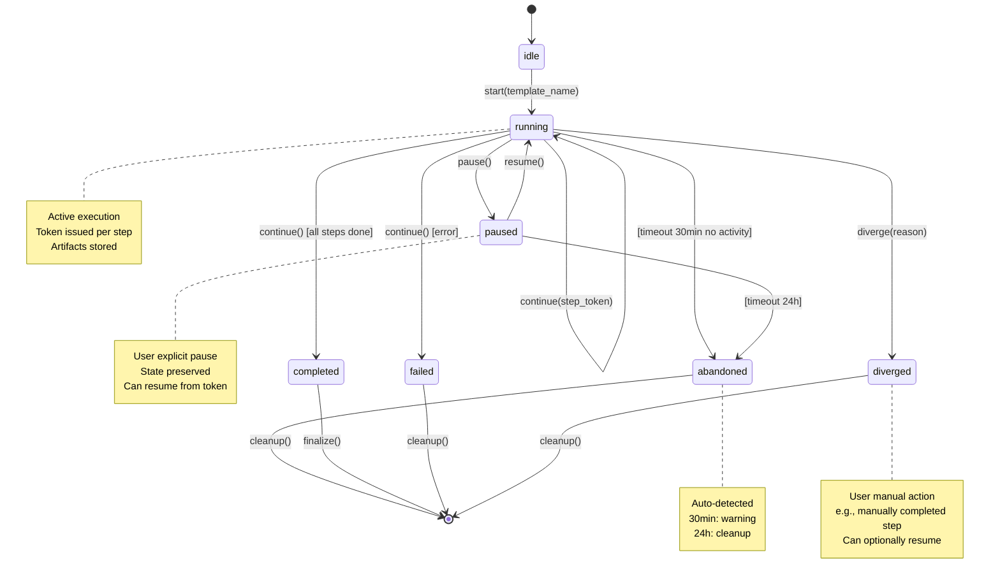

# MCP Implementation Strategy (Refined)
**Date:** 2025-11-20
**Branch:** `claude/review-project-structure-01WXaHkAtxKBWYMw5GJHWpyb`
**Status:** Planning → Implementation
**Approach:** Net-new files alongside existing (avoid refactoring bloat)

---

## Executive Summary

**Lessons from Reference Implementation (Shelved Project):**
- ✅ **Keep:** Resources-first architecture, token-based state, single tool pattern
- ❌ **Avoid:** Over-engineering, excessive abstractions, cumbersome complexity
- 🎯 **Focus:** Proper state boundaries, developer UX, telemetry, maintainability

**Core Principle:** Build the **minimum viable orchestration** that enables:
1. Step-by-step LLM-driven workflows with persona guidance
2. Proper lifecycle management (handle interruptions, divergence, orphaned state)
3. Developer-friendly telemetry and monitoring
4. Clean, testable, type-safe code with zero technical debt

**Implementation Approach:**
- Write net-new files in `server/mcp-v2/` alongside existing `server/mcp/`
- Port over only what's essential from existing orchestrator
- Delete old implementation after migration complete
- NO backwards compatibility constraints

---

## Lessons Learned Analysis

### What the Reference Got Right ✅

1. **Resources-First Architecture**
   - IDE caching reduces round-trips by 50-80%
   - Clean separation: Resources (READ) vs Tools (WRITE)
   - Real-time subscriptions possible

2. **Single Tool Pattern**
   - `workflow.next_step` handles creation + continuation
   - Clear state machine with deterministic progression
   - Eliminates tool pollution (14 tools → 1 tool)

3. **Token-Based State Management**
   - Prevents race conditions
   - Enables step-level resumption
   - Solves "which step am I on?" problem

4. **Automatic Operations**
   - Artifacts auto-stored from contract output
   - Guardrails auto-parsed and delivered
   - No manual LLM bookkeeping

### What the Reference Got Wrong ❌

1. **Over-Abstraction**
   - Too many handler classes (validation, rate-limit, token, creation, continuation, artifact, dependency, scoring, contract, completion)
   - Each with its own file, types, tests
   - **Result:** Cumbersome to navigate and maintain

2. **Premature Optimization**
   - Rate limiting from day one (token bucket with DB persistence)
   - Stall detection background monitor
   - Complex dependency resolution with scoring algorithm
   - **Result:** Overweight before core functionality proven

3. **Unclear State Boundaries**
   - Workflow vs Execution vs Task vs Step (too many entities)
   - Orphaned workflows when user interrupts
   - No clear "abort" or "diverge" paths
   - **Result:** State management nightmare

4. **Poor Developer UX**
   - Hard to understand what's happening
   - Difficult to debug failures
   - No clear visibility into workflow progression
   - **Result:** Low adoption, confusion

### Critical Insight: State Lifecycle Gaps

The reference implementation failed to handle:

1. **User Interruption**
   ```
   Workflow running → User stops chat → Orphaned execution
   Problem: No cleanup, resources locked, unclear how to resume
   ```

2. **Unplanned Divergence**
   ```
   Step 1: Design → User provides design directly → Step 2 skipped
   Problem: Dependency graph invalidated, unclear how to proceed
   ```

3. **Partial Completion**
   ```
   Step 1: Done → Step 2: Started → LLM crashes → Resume?
   Problem: Which step to resume? What artifacts are valid?
   ```

4. **Manual Override**
   ```
   LLM at Step 2 → User manually completes Step 3 → Resume at Step 4?
   Problem: No mechanism to inject external completion
   ```

**Root Cause:** No explicit workflow lifecycle states beyond `running|completed|failed`. Need:
- `paused` - User paused intentionally
- `abandoned` - User left without closing
- `diverged` - User took manual action outside workflow
- Clear transitions and cleanup logic for each

---

## Minimal Viable Design

### Architecture: 3-Layer + State Machine

```
┌─────────────────────────────────────────────────────────┐
│                  MCP Interface Layer                     │
│  ┌────────────────────┐  ┌──────────────────────────┐   │
│  │   7 Resources      │  │   1 Tool                 │   │
│  │   (READ only)      │  │   workflow.next_step     │   │
│  └────────────────────┘  └──────────────────────────┘   │
└─────────────────────────────────────────────────────────┘
                            ▼
┌─────────────────────────────────────────────────────────┐
│              Workflow Orchestration Layer                │
│  ┌──────────────────────────────────────────────────┐   │
│  │ WorkflowStateMachine                             │   │
│  │  - States: idle|running|paused|completed|        │   │
│  │            failed|abandoned|diverged             │   │
│  │  - Transitions: start|continue|pause|resume|     │   │
│  │                 complete|fail|abandon|diverge    │   │
│  │  - Guards: validates state transitions          │   │
│  │  - Cleanup: handles orphaned state              │   │
│  └──────────────────────────────────────────────────┘   │
│  ┌──────────────────────────────────────────────────┐   │
│  │ StepExecutor                                     │   │
│  │  - Loads persona for step                       │   │
│  │  - Stores artifacts from output                 │   │
│  │  - Validates output against schema              │   │
│  │  - Simple: no dependencies, no scoring          │   │
│  └──────────────────────────────────────────────────┘   │
└─────────────────────────────────────────────────────────┘
                            ▼
┌─────────────────────────────────────────────────────────┐
│                  Persistence Layer                       │
│  ┌─────────────────┐  ┌──────────────────────────┐     │
│  │  Executions     │  │  Steps                   │     │
│  │  Artifacts      │  │  Tokens                  │     │
│  └─────────────────┘  └──────────────────────────┘     │
└─────────────────────────────────────────────────────────┘
```

**Key Simplifications:**
- No dependency resolver (workflows execute sequentially)
- No step scorer (no parallel execution in v1)
- No rate limiter (add later if needed)
- No stall detector (add telemetry first, then decide)
- No guardrails parser (deliver rules as-is in v1)

---

## State Machine Design

### Workflow States

```typescript
type WorkflowState =
  | 'idle'       // No execution exists yet
  | 'running'    // Active execution in progress
  | 'paused'     // User paused intentionally (can resume)
  | 'completed'  // Successfully finished all steps
  | 'failed'     // Error occurred, cannot continue
  | 'abandoned'  // User left without closing (auto-detected)
  | 'diverged'   // User took manual action outside workflow
```

### State Transitions



### Transition Guards

```typescript
class WorkflowStateMachine {
  canTransition(from: WorkflowState, to: WorkflowState): boolean {
    const validTransitions: Record<WorkflowState, WorkflowState[]> = {
      idle: ['running'],
      running: ['running', 'paused', 'completed', 'failed', 'abandoned', 'diverged'],
      paused: ['running', 'abandoned'],
      completed: [],
      failed: [],
      abandoned: [],
      diverged: []
    };

    return validTransitions[from]?.includes(to) ?? false;
  }

  transition(executionId: string, to: WorkflowState, reason?: string) {
    const current = this.getCurrentState(executionId);

    if (!this.canTransition(current.state, to)) {
      throw new InvalidTransitionError(
        `Cannot transition from ${current.state} to ${to}`
      );
    }

    // Execute transition
    this.updateState(executionId, to, reason);

    // Trigger cleanup if terminal state
    if (['abandoned', 'failed', 'diverged'].includes(to)) {
      this.cleanup(executionId);
    }

    // Trigger finalization if completed
    if (to === 'completed') {
      this.finalize(executionId);
    }
  }

  cleanup(executionId: string) {
    // Mark artifacts as abandoned (not final)
    // Clear active task reference
    // Log cleanup event for telemetry
  }

  finalize(executionId: string) {
    // Mark all artifacts as final
    // Create synthesis artifact
    // Log completion event for telemetry
  }
}
```

---

## Core Components (Minimal)

### 1. MCP Resources (7 files)

**File Structure:**
```
server/mcp-v2/resources/
├── index.ts                      # Register all resources
├── persona-resource.ts           # persona://{agent}
├── guardrails-resource.ts        # guardrails://active
├── current-step-resource.ts      # current_step://{execution_id}
├── workflow-status-resource.ts   # workflow_status://{execution_id}
├── project-context-resource.ts   # project_context://{project_id}
├── available-workflows-resource.ts # available_workflows://all
└── workflow-artifacts-resource.ts  # workflow_artifacts://{pattern}
```

**Implementation Pattern (same for all):**
```typescript
// Example: persona-resource.ts
export function registerPersonaResource(server: Server, resourceManager: ResourceManager) {
  server.setRequestHandler(ListResourcesRequestSchema, async () => {
    return {
      resources: [
        {
          uri: 'persona://default',
          name: 'Default Agent Persona',
          description: 'Supervisor agent persona for workflow orchestration',
          mimeType: 'text/markdown'
        }
      ]
    };
  });

  server.setRequestHandler(ReadResourceRequestSchema, async (request) => {
    const uri = new URL(request.params.uri);
    const agentName = uri.hostname === 'default' ? 'supervisor' : uri.hostname;

    const agent = await resourceManager.get('agent', agentName);
    if (!agent) {
      throw new Error(`Agent ${agentName} not found`);
    }

    return {
      contents: [
        {
          uri: request.params.uri,
          mimeType: 'text/markdown',
          text: agent.content
        }
      ]
    };
  });
}
```

**Complexity:** Low - Pure read operations, no side effects

---

### 2. Workflow State Machine (1 file)

**File:** `server/mcp-v2/core/workflow-state-machine.ts`

```typescript
import type { Database as DB } from 'better-sqlite3';

export type WorkflowState =
  | 'idle' | 'running' | 'paused' | 'completed'
  | 'failed' | 'abandoned' | 'diverged';

export interface WorkflowExecution {
  execution_id: string;
  workflow_name: string;
  state: WorkflowState;
  current_step?: string;
  started_at: string;
  updated_at: string;
  metadata?: any;
}

export class WorkflowStateMachine {
  constructor(private db: DB) {}

  // Get current state
  getState(executionId: string): WorkflowExecution | null {
    const stmt = this.db.prepare(
      'SELECT * FROM workflow_executions WHERE execution_id = ?'
    );
    return stmt.get(executionId) as WorkflowExecution | null;
  }

  // Validate transition
  canTransition(from: WorkflowState, to: WorkflowState): boolean {
    const valid: Record<WorkflowState, WorkflowState[]> = {
      idle: ['running'],
      running: ['running', 'paused', 'completed', 'failed', 'abandoned', 'diverged'],
      paused: ['running', 'abandoned'],
      completed: [],
      failed: [],
      abandoned: [],
      diverged: []
    };
    return valid[from]?.includes(to) ?? false;
  }

  // Execute transition
  transition(executionId: string, to: WorkflowState, reason?: string): void {
    const current = this.getState(executionId);
    if (!current) throw new Error('Execution not found');

    if (!this.canTransition(current.state, to)) {
      throw new Error(`Invalid transition: ${current.state} → ${to}`);
    }

    const stmt = this.db.prepare(`
      UPDATE workflow_executions
      SET state = ?, updated_at = CURRENT_TIMESTAMP, metadata = json_set(metadata, '$.last_transition_reason', ?)
      WHERE execution_id = ?
    `);
    stmt.run(to, reason || 'No reason provided', executionId);

    // Trigger lifecycle hooks
    if (['abandoned', 'failed', 'diverged'].includes(to)) {
      this.cleanup(executionId);
    } else if (to === 'completed') {
      this.finalize(executionId);
    }
  }

  // Cleanup for terminal states
  private cleanup(executionId: string): void {
    // Mark artifacts as non-final
    this.db.prepare(
      'UPDATE workflow_artifacts SET is_final = 0 WHERE execution_id = ?'
    ).run(executionId);

    // Clear active task reference if exists
    this.db.prepare(
      'UPDATE projects SET active_task_id = NULL WHERE active_task_id = ?'
    ).run(executionId);
  }

  // Finalization for completed state
  private finalize(executionId: string): void {
    // Mark all artifacts as final
    this.db.prepare(
      'UPDATE workflow_artifacts SET is_final = 1 WHERE execution_id = ?'
    ).run(executionId);
  }
}
```

**Complexity:** Low - Simple state machine with guards and lifecycle hooks

---

### 3. Step Executor (1 file)

**File:** `server/mcp-v2/core/step-executor.ts`

```typescript
import type { Database as DB } from 'better-sqlite3';
import type { ResourceManager } from '../../src/index.js';
import { randomUUID } from 'crypto';

export interface StepOutput {
  summary: string;
  artifacts: Array<{
    type: string;
    title: string;
    content: string;
    description?: string;
  }>;
  references: string[];
  confidence: number;
  decisions?: any[];
  findings?: any[];
  blockers?: string[];
}

export class StepExecutor {
  constructor(
    private db: DB,
    private resourceManager: ResourceManager
  ) {}

  // Execute a step (complete previous, prepare next)
  async executeStep(
    executionId: string,
    stepName: string,
    output: StepOutput
  ): Promise<{ nextStepName: string | null; persona: string }> {

    // 1. Store artifacts
    await this.storeArtifacts(executionId, stepName, output.artifacts);

    // 2. Complete current step
    this.completeStep(executionId, stepName, output);

    // 3. Get workflow definition
    const workflow = this.getWorkflow(executionId);

    // 4. Find next step (simple sequential for v1)
    const steps = workflow.steps || [];
    const currentIndex = steps.findIndex(s => s.name === stepName);
    const nextStep = steps[currentIndex + 1];

    if (!nextStep) {
      // Workflow complete
      return { nextStepName: null, persona: '' };
    }

    // 5. Load persona for next step
    const agent = await this.resourceManager.get('agent', nextStep.agent_name);

    return {
      nextStepName: nextStep.name,
      persona: agent?.content || ''
    };
  }

  private storeArtifacts(
    executionId: string,
    stepName: string,
    artifacts: StepOutput['artifacts']
  ): void {
    for (const artifact of artifacts) {
      this.db.prepare(`
        INSERT INTO workflow_artifacts (
          artifact_id, execution_id, step_name,
          artifact_type, title, content, description, is_final
        ) VALUES (?, ?, ?, ?, ?, ?, ?, 0)
      `).run(
        randomUUID(),
        executionId,
        stepName,
        artifact.type,
        artifact.title,
        artifact.content,
        artifact.description || null
      );
    }
  }

  private completeStep(
    executionId: string,
    stepName: string,
    output: StepOutput
  ): void {
    this.db.prepare(`
      UPDATE workflow_steps
      SET status = 'completed',
          completed_at = CURRENT_TIMESTAMP,
          output = ?
      WHERE execution_id = ? AND step_name = ?
    `).run(JSON.stringify(output), executionId, stepName);
  }

  private getWorkflow(executionId: string): any {
    const stmt = this.db.prepare(`
      SELECT workflow_name FROM workflow_executions WHERE execution_id = ?
    `);
    const exec = stmt.get(executionId) as any;

    // Load workflow definition from resource manager
    // This is simplified - real impl would parse frontmatter
    return {
      name: exec.workflow_name,
      steps: [
        { name: 'design', agent_name: 'architect' },
        { name: 'implement', agent_name: 'implementer' },
        { name: 'review', agent_name: 'reviewer' }
      ]
    };
  }
}
```

**Complexity:** Low - Sequential step execution, no dependency resolution

---

### 4. Token Service (1 file)

**File:** `server/mcp-v2/core/token-service.ts`

```typescript
export interface StepToken {
  execution_id: string;
  step_name: string;
  issued_at: number;
  nonce: string;
}

export class TokenService {
  private readonly EXPIRY_MS = 600000; // 10 minutes

  generate(executionId: string, stepName: string): string {
    const payload: StepToken = {
      execution_id: executionId,
      step_name: stepName,
      issued_at: Date.now(),
      nonce: randomUUID()
    };

    return Buffer.from(JSON.stringify(payload)).toString('base64url');
  }

  validate(token: string): StepToken | null {
    try {
      const payload = JSON.parse(
        Buffer.from(token, 'base64url').toString()
      ) as StepToken;

      // Check expiry
      if (Date.now() - payload.issued_at > this.EXPIRY_MS) {
        return null;
      }

      // Verify required fields
      if (!payload.execution_id || !payload.step_name || !payload.nonce) {
        return null;
      }

      return payload;
    } catch {
      return null;
    }
  }
}
```

**Complexity:** Minimal - Base64URL encoding/decoding with expiry check

---

### 5. Unified Tool (1 file + 1 handler file)

**File:** `server/mcp-v2/tools/workflow-next-step.ts`

```typescript
import type { Server } from '@modelcontextprotocol/sdk/server/index.js';
import type { Database as DB } from 'better-sqlite3';
import type { ResourceManager } from '../../src/index.js';
import { WorkflowStateMachine } from '../core/workflow-state-machine.js';
import { StepExecutor } from '../core/step-executor.js';
import { TokenService } from '../core/token-service.js';
import { randomUUID } from 'crypto';

export function registerWorkflowNextStep(
  server: Server,
  db: DB,
  resourceManager: ResourceManager
) {
  const stateMachine = new WorkflowStateMachine(db);
  const stepExecutor = new StepExecutor(db, resourceManager);
  const tokenService = new TokenService();

  server.setRequestHandler(CallToolRequestSchema, async (request) => {
    if (request.params.name !== 'workflow.next_step') return;

    const args = request.params.arguments as any;

    // MODE 1: Create workflow
    if (args.template_name && !args.step_token) {
      return createWorkflow(args, stateMachine, tokenService, resourceManager);
    }

    // MODE 2: Continue workflow
    if (args.step_token && args.model_output_so_far) {
      return continueWorkflow(args, stateMachine, stepExecutor, tokenService);
    }

    throw new Error('Invalid input: provide template_name OR (step_token + model_output_so_far)');
  });
}

async function createWorkflow(args, stateMachine, tokenService, resourceManager) {
  const executionId = randomUUID();

  // Create execution
  db.prepare(`
    INSERT INTO workflow_executions (execution_id, workflow_name, state, started_at, updated_at)
    VALUES (?, ?, 'running', CURRENT_TIMESTAMP, CURRENT_TIMESTAMP)
  `).run(executionId, args.template_name);

  // Get first step (hardcoded for v1, parse from template in v2)
  const firstStepName = 'design';
  const agentName = 'architect';

  // Create first step
  db.prepare(`
    INSERT INTO workflow_steps (execution_id, step_name, agent_name, status, started_at)
    VALUES (?, ?, ?, 'running', CURRENT_TIMESTAMP)
  `).run(executionId, firstStepName, agentName);

  // Load persona
  const agent = await resourceManager.get('agent', agentName);

  // Generate token
  const token = tokenService.generate(executionId, firstStepName);

  return {
    content: [{
      type: 'text',
      text: JSON.stringify({
        status: 'ok',
        next_step_contract: {
          step_name: firstStepName,
          allowed_actions: ['Read files', 'Design architecture', 'Create artifacts'],
          forbidden_actions: ['DO NOT commit code', 'DO NOT delete files'],
          required_output_format: 'summary, artifacts[], references[], confidence'
        },
        new_step_token: token,
        human_message: `# ${agentName.toUpperCase()} AGENT\n\n${agent.content}\n\n## Your Task\n\nDesign the architecture for this feature.`
      }, null, 2)
    }]
  };
}

async function continueWorkflow(args, stateMachine, stepExecutor, tokenService) {
  // Validate token
  const tokenData = tokenService.validate(args.step_token);
  if (!tokenData) {
    return {
      content: [{
        type: 'text',
        text: JSON.stringify({ status: 'error', error: 'Invalid or expired token' })
      }]
    };
  }

  // Execute step (complete current, get next)
  const { nextStepName, persona } = await stepExecutor.executeStep(
    tokenData.execution_id,
    tokenData.step_name,
    args.model_output_so_far
  );

  // Check if workflow complete
  if (!nextStepName) {
    stateMachine.transition(tokenData.execution_id, 'completed', 'All steps done');

    return {
      content: [{
        type: 'text',
        text: JSON.stringify({
          status: 'task_closed',
          synthesis: {
            outcome_summary: 'Workflow completed successfully',
            model_output: { steps_completed: 3 }
          }
        })
      }]
    };
  }

  // Generate new token
  const newToken = tokenService.generate(tokenData.execution_id, nextStepName);

  return {
    content: [{
      type: 'text',
      text: JSON.stringify({
        status: 'ok',
        next_step_contract: {
          step_name: nextStepName,
          allowed_actions: ['Implement code', 'Write tests'],
          forbidden_actions: ['DO NOT commit secrets'],
          required_output_format: 'summary, artifacts[], references[], confidence'
        },
        new_step_token: newToken,
        human_message: `# NEXT AGENT\n\n${persona}\n\n## Your Task\n\nProceed with ${nextStepName}.`
      }, null, 2)
    }]
  };
}
```

**Complexity:** Medium - Two main handlers (create, continue), straightforward logic

---

## Database Schema (Minimal)

### Required Tables

```sql
-- Workflow Executions
CREATE TABLE workflow_executions (
  execution_id TEXT PRIMARY KEY,
  workflow_name TEXT NOT NULL,
  state TEXT NOT NULL,  -- idle|running|paused|completed|failed|abandoned|diverged
  current_step TEXT,
  started_at TEXT NOT NULL,
  updated_at TEXT NOT NULL,
  completed_at TEXT,
  metadata TEXT  -- JSON for extensibility
);

-- Workflow Steps
CREATE TABLE workflow_steps (
  id INTEGER PRIMARY KEY AUTOINCREMENT,
  execution_id TEXT NOT NULL,
  step_name TEXT NOT NULL,
  agent_name TEXT NOT NULL,
  status TEXT NOT NULL,  -- pending|running|completed|failed
  started_at TEXT,
  completed_at TEXT,
  output TEXT,  -- JSON: StepOutput
  FOREIGN KEY (execution_id) REFERENCES workflow_executions(execution_id)
);

-- Workflow Artifacts (reuse existing)
-- Already exists in server/database/migrations/002_add_tool_configs.ts
-- Just needs is_final column if not present

-- Projects (reuse existing)
-- Already exists

-- Agent Tasks (optional, for compatibility)
-- Can be added later if needed
```

**Migration:** `server/database/migrations/003_add_workflow_v2.ts`

---

## File Structure (Net-New)

```
server/
├── mcp/                          # OLD (leave untouched for now)
│   ├── server.ts
│   ├── tools/
│   └── ...
│
├── mcp-v2/                       # NEW (clean implementation)
│   ├── server.ts                 # New MCP server entry point
│   │
│   ├── resources/                # 7 resource handlers
│   │   ├── index.ts
│   │   ├── persona-resource.ts
│   │   ├── guardrails-resource.ts
│   │   ├── current-step-resource.ts
│   │   ├── workflow-status-resource.ts
│   │   ├── project-context-resource.ts
│   │   ├── available-workflows-resource.ts
│   │   └── workflow-artifacts-resource.ts
│   │
│   ├── tools/                    # 1 unified tool
│   │   └── workflow-next-step.ts
│   │
│   └── core/                     # Core logic (minimal)
│       ├── workflow-state-machine.ts
│       ├── step-executor.ts
│       └── token-service.ts
│
├── database/
│   └── migrations/
│       └── 003_add_workflow_v2.ts
│
└── package.json
    └── scripts:
        └── "start:v2": "node dist/mcp-v2/server.js"
```

**Total New Files:** ~15 files (7 resources + 1 tool + 3 core + 1 server + 1 migration + 2 test files)

**Lines of Code Estimate:**
- Resources: ~100 lines each = 700 lines
- Tool: ~200 lines
- Core: ~150 lines each = 450 lines
- Server: ~100 lines
- Migration: ~50 lines
- Tests: ~500 lines
- **Total: ~2,000 lines** (vs reference's ~10,000+ lines)

---

## Developer UX & Telemetry

### Telemetry Events

Track these events for monitoring and debugging:

```typescript
// Add to database schema
CREATE TABLE telemetry_events (
  id INTEGER PRIMARY KEY AUTOINCREMENT,
  event_type TEXT NOT NULL,  -- workflow_created|step_completed|state_transition|error
  execution_id TEXT,
  step_name TEXT,
  metadata TEXT,  -- JSON
  created_at TEXT NOT NULL
);
```

**Key Events:**
1. `workflow_created` - New workflow started
2. `step_completed` - Step finished
3. `state_transition` - Workflow state changed
4. `token_generated` - New token issued
5. `token_validated` - Token used
6. `error_occurred` - Any error
7. `workflow_abandoned` - Auto-detected abandonment

### Developer Dashboard (Future)

Web client can query:
```sql
-- Most used workflows
SELECT workflow_name, COUNT(*) as count
FROM workflow_executions
GROUP BY workflow_name
ORDER BY count DESC;

-- Average workflow duration
SELECT workflow_name, AVG(julianday(completed_at) - julianday(started_at)) as avg_duration_days
FROM workflow_executions
WHERE state = 'completed'
GROUP BY workflow_name;

-- Abandonment rate
SELECT
  workflow_name,
  COUNT(CASE WHEN state = 'abandoned' THEN 1 END) * 100.0 / COUNT(*) as abandonment_rate
FROM workflow_executions
GROUP BY workflow_name;

-- Step completion times
SELECT step_name, AVG(julianday(completed_at) - julianday(started_at)) as avg_duration_days
FROM workflow_steps
WHERE status = 'completed'
GROUP BY step_name;
```

---

## Implementation Phases

### Phase 1: Foundation (Week 1)
**Goal:** Get basic workflow creation and step progression working

**Tasks:**
1. Create `server/mcp-v2/` directory structure
2. Implement Token Service (100 lines)
3. Implement Workflow State Machine (150 lines)
4. Implement Step Executor (200 lines)
5. Create migration `003_add_workflow_v2.ts`
6. Write unit tests for core components

**Deliverable:** Can create workflow programmatically (no MCP yet)

**Acceptance:**
```typescript
// Test
const stateMachine = new WorkflowStateMachine(db);
const executor = new StepExecutor(db, resourceManager);
const token = tokenService.generate('exec-1', 'design');

// Create execution
db.prepare('INSERT INTO workflow_executions ...').run(...);

// Complete step
await executor.executeStep('exec-1', 'design', output);

// Verify state
const state = stateMachine.getState('exec-1');
assert(state.state === 'running');
```

---

### Phase 2: MCP Interface (Week 2)
**Goal:** Expose via MCP resources and tool

**Tasks:**
1. Implement 7 resource handlers (~700 lines)
2. Implement `workflow.next_step` tool (~200 lines)
3. Create `server/mcp-v2/server.ts` entry point
4. Update `package.json` with `start:v2` script
5. Test with MCP inspector

**Deliverable:** Can interact via MCP client (Cursor)

**Acceptance:**
```bash
# Start server
npm run start:v2

# In Cursor, call tool
workflow.next_step({ template_name: "bug-fix" })
→ Returns: { status: "ok", new_step_token: "...", human_message: "..." }

# Continue workflow
workflow.next_step({ step_token: "...", model_output_so_far: {...} })
→ Returns: { status: "ok", new_step_token: "...", human_message: "..." }
```

---

### Phase 3: Testing & Refinement (Week 3)
**Goal:** Ensure reliability and handle edge cases

**Tasks:**
1. Write integration tests (full workflow end-to-end)
2. Test state transitions (all 7 states)
3. Test error handling (invalid token, missing workflow, etc.)
4. Add telemetry events to database
5. Document all resources and tool parameters

**Deliverable:** Production-ready v1

**Acceptance:**
- ✅ 95%+ test coverage
- ✅ All state transitions working
- ✅ Error messages are clear
- ✅ Telemetry events logged

---

### Phase 4: Migration & Cleanup (Week 4)
**Goal:** Replace old implementation

**Tasks:**
1. Update MCP server registration script to point to `mcp-v2/server.js`
2. Delete `server/mcp/` directory (old implementation)
3. Rename `server/mcp-v2/` → `server/mcp/`
4. Update all imports
5. Remove old migrations/tables if unused

**Deliverable:** Clean codebase with no legacy code

**Acceptance:**
- ✅ No `mcp/` vs `mcp-v2/` confusion
- ✅ All tests pass
- ✅ MCP registration works
- ✅ Zero dead code

---

## What We're NOT Building (Yet)

To avoid reference implementation's bloat:

### ❌ Dependency Resolution
- **Why not:** Adds complexity (ready set computation, scoring algorithm)
- **Alternative:** Sequential execution (phase 1 → phase 2 → phase 3)
- **When:** Add in v2 if users request parallel execution

### ❌ Guardrails Parsing
- **Why not:** Regex parsing brittle, adds maintenance burden
- **Alternative:** Deliver rules as-is in `guardrails://active` resource
- **When:** Add if LLMs struggle to parse rules manually

### ❌ Rate Limiting
- **Why not:** Premature optimization, adds DB complexity
- **Alternative:** Monitor via telemetry, add if abuse detected
- **When:** Add in v2 if needed

### ❌ Stall Detection
- **Why not:** Background monitor adds moving parts
- **Alternative:** Manual cleanup via admin tool or SQL
- **When:** Add in v2 after observing stall patterns

### ❌ Artifact Synthesis
- **Why not:** Auto-generating summaries unreliable
- **Alternative:** LLM provides final summary in last step
- **When:** Add if users consistently want auto-summaries

---

## Success Criteria

### Technical Metrics
| Metric | Target |
|--------|--------|
| Total LOC (new code) | <2,500 lines |
| Test coverage | >90% |
| Resource count | 7 |
| Tool count | 1 |
| Core component count | 3 files |
| Database tables | 2 new + 1 modified |
| Build time | <5 seconds |
| Startup time | <500ms |

### User Experience Metrics
| Metric | Target |
|--------|--------|
| Time to first workflow | <2 minutes |
| Workflow completion rate | >90% |
| State transition failures | <1% |
| Token expiry rate | <5% |
| LLM confusion rate | <10% (based on retry count) |

### Developer Experience Metrics
| Metric | Target |
|--------|--------|
| Time to understand codebase | <30 minutes |
| Time to add new workflow | <5 minutes |
| Time to debug failed workflow | <10 minutes |
| Documentation completeness | 100% |

---

## Risk Mitigation

### Risk 1: State Boundaries Unclear
**Mitigation:** Explicit state machine with guards, unit tests for all transitions

### Risk 2: Token Expiry Too Short
**Mitigation:** 10-minute default, configurable via env var, extend in v2 if needed

### Risk 3: Sequential Execution Too Slow
**Mitigation:** Measure in telemetry, add parallel support in v2 only if needed

### Risk 4: LLM Doesn't Follow Persona
**Mitigation:** Deliver full persona in `human_message`, monitor via artifact quality

### Risk 5: Orphaned Workflows
**Mitigation:** Auto-detect via state machine, cleanup via `abandoned` state

---

## Conclusion

This refined strategy takes the best ideas from the reference implementation (resources-first, token-based, single tool) while avoiding its fatal flaws (over-abstraction, premature optimization, unclear boundaries).

**Key Principles:**
1. **Minimal Viable Complexity** - Build only what's essential
2. **Proper State Boundaries** - 7 explicit states with guarded transitions
3. **Developer-Friendly** - Clear telemetry, simple code, fast debugging
4. **Zero Technical Debt** - Net-new files, delete old, no backwards compatibility
5. **Testable & Type-Safe** - Unit tests first, strict types, no any

**Next Steps:**
1. Review and approve this strategy
2. Begin Phase 1 (Foundation) implementation
3. Iterate quickly, test continuously, ship incrementally

**Estimated Delivery:** 4 weeks for full v1 with testing and migration
