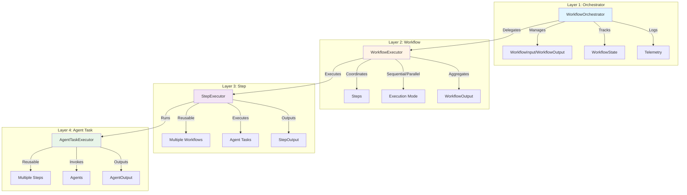

# Workflow Lifecycle Orchestrator

Layered orchestrator system for managing multi-agent workflow execution with contracts, state management, retry/escalation, and telemetry.

## Architecture



## Layers

### Layer 1: Orchestrator
- Manages workflow execution lifecycle
- Validates inputs/outputs via contracts
- State management (pending → running → completed/failed/escalated)
- Retry and escalation logic
- Telemetry at orchestrator level

### Layer 2: Workflow
- Coordinates step execution
- Supports sequential, parallel, conditional modes
- Aggregates step outputs into workflow output
- Guards and constraints
- Can be invoked by agents or orchestrator

### Layer 3: Step
- Reusable across multiple workflows
- Executes agent tasks
- StepInput/StepOutput contracts
- Can be invoked independently by agents
- Task aggregation

### Layer 4: Agent Task
- Lowest level execution unit
- Agent-specific task execution
- AgentInput/AgentOutput contracts
- Reusable across multiple steps
- Direct agent invocation

## Contracts

Each layer enforces contracts:

- **WorkflowInput/WorkflowOutput**: Orchestrator level
- **StepInput/StepOutput**: Step level
- **AgentInput/AgentOutput**: Agent task level

All contracts validated at runtime for type safety.

## Contract Validation Constraints

All contract schemas enforce strict validation to prevent data bloat, DoS attacks, and ensure reliable execution.

### Layer 1: Workflow Contracts

**WorkflowInputSchema** (`schemas.ts:36-41`):
```typescript
{
  name: string (1-200 chars)
  reason: string (1-2000 chars)
  triggers?: Triggers  // From content-registry/lib/shared-schemas
  expected_output: 'WorkflowOutput'
}
```

**WorkflowOutputSchema** (`schemas.ts:46-60`):
```typescript
{
  summary: string (max 5000 chars)
  workflow: {
    name: string (max 200 chars)
    reason?: string (max 2000 chars)
  }
  steps: StepOutput[] (max 100 items, default: [])
  artifacts: Artifact[] (max 100 items, default: [])
  decisions: Decision[] (max 50 items, default: [])
  findings: Finding[] (max 100 items, default: [])
  next_steps: string[] (max 50 items × 500 chars, default: [])
  blockers: string[] (max 50 items × 500 chars, default: [])
  references: string[] (max 100 items × 500 chars, default: [])
  confidence: number (0-1)
}
```

### Layer 2: Step Contracts

**StepInputSchema** (`schemas.ts:63-69`):
```typescript
{
  step: string (1-200 chars)
  task: string (1-2000 chars)
  constraints: string[] (max 50 items × 500 chars, default: [])
  references: string[] (max 100 items × 500 chars, default: [])
  expected_output: 'StepOutput'
}
```

**StepOutputSchema** (`schemas.ts:71-79`):
```typescript
{
  summary: string (max 5000 chars)
  artifacts: Artifact[] (max 100 items, default: [])
  findings: Finding[] (max 100 items, default: [])
  next_steps: string[] (max 50 items × 500 chars, default: [])
  blockers: string[] (max 50 items × 500 chars, default: [])
  references: string[] (max 100 items × 500 chars, default: [])
  confidence: number (0-1)
}
```

### Layer 3: Agent Task Contracts

**AgentInputSchema** (`schemas.ts:82-87`):
```typescript
{
  task: string (1-2000 chars)
  constraints: string[] (max 50 items × 500 chars, default: [])
  references: string[] (max 100 items × 500 chars, default: [])
  expected_output: 'AgentOutput'
}
```

**AgentOutputSchema** (`schemas.ts:89-98`):
```typescript
{
  summary: string (max 5000 chars)
  artifacts: Artifact[] (max 100 items, default: [])
  decisions: Decision[] (max 50 items, default: [])
  findings: Finding[] (max 100 items, default: [])
  next_steps: string[] (max 50 items × 500 chars, default: [])
  blockers: string[] (max 50 items × 500 chars, default: [])
  references: string[] (max 100 items × 500 chars, default: [])
  confidence: number (0-1)
}
```

### Supporting Schemas

**ArtifactSchema** (`schemas.ts:10-16`):
```typescript
{
  type: string (max 100 chars)
  title: string (max 200 chars)
  content: string (unlimited for long-form content)
  description?: string (max 1000 chars)
  metadata?: Record<string, unknown>
}
```

**DecisionSchema** (`schemas.ts:18-24`):
```typescript
{
  decision: string (max 500 chars)
  rationale: string (max 2000 chars)
  alternatives_rejected: string[] (max 10 items × 500 chars, default: [])
  trade_offs?: string (max 1000 chars)
  context?: string (max 2000 chars)
}
```

**FindingSchema** (`schemas.ts:26-33`):
```typescript
{
  severity: 'critical' | 'high' | 'medium' | 'low'
  category?: string (max 100 chars)
  description: string (max 1000 chars)
  location?: string (max 500 chars)
  recommendation?: string (max 1000 chars)
  impact?: string (max 1000 chars)
}
```

### Validation Benefits

- **Resource Protection**: Prevents unbounded execution output bloat
- **DoS Prevention**: Limits on arrays and string lengths prevent attacks
- **Consistent Defaults**: All optional arrays default to `[]`
- **Type Safety**: TypeScript types inferred from schemas via `z.infer<>`
- **Contract Enforcement**: Invalid inputs/outputs rejected immediately
- **Early Detection**: Validation failures caught before agent execution

## State Management

Stable state tracking at each layer:

- **WorkflowState**: `pending` → `running` → `completed` | `failed` | `escalated`
- **StepState**: `pending` → `running` → `completed` | `failed` | `retrying`
- **AgentTaskState**: `pending` → `running` → `completed` | `failed`

State includes:
- Start/completion timestamps
- Retry counts
- Outputs and errors
- Full execution history

## Retry & Escalation

### Retry Logic
- Configurable max attempts and backoff
- Per-layer retry policies
- Exponential backoff support

### Escalation
Automatic escalation when:
- Critical findings threshold reached
- High severity findings exceed limit
- Total blockers exceed threshold

Configurable via `OrchestratorConfig.escalationThreshold`.

## Telemetry

Comprehensive logging at each layer:

```typescript
telemetry.workflowStarted(workflowId, workflowName);
telemetry.stepStarted(workflowId, stepId, stepName);
telemetry.taskStarted(workflowId, stepId, taskId, agent);
```

All events include:
- Timestamp
- Layer identification
- Context metadata
- Duration tracking

## Configuration

Centralized constants in `config.ts`:

```typescript
OrchestratorConfig = {
  defaultMaxRetries: 3,
  defaultBackoffMs: 1000,
  workflowTimeoutMs: 3600000,
  escalationThreshold: { ... },
  // ...
}
```

## Usage

```typescript
import { WorkflowOrchestrator } from '@/core/workflow-orchestrator';

const orchestrator = new WorkflowOrchestrator();

const result = await orchestrator.execute({
  name: 'feature-development',
  reason: 'Implement new user authentication',
  expected_output: 'WorkflowOutput',
});

console.log(`Workflow ${result.workflowId} ${result.state}`);
console.log(`Confidence: ${result.output.confidence}`);
```

## Key Files

- `index.ts` - Main orchestrator class
- `schemas.ts` - Contract validation schemas (Zod)
- `errors.ts` - Error hierarchy
- `workflow-orchestrator.test.ts` - Integration tests
- `lib/` - Internal implementation
  - `execution-boundary.ts` - Input/output validation
  - `execution-state.ts` - Runtime state types
  - `config.ts` - Configuration constants
  - `retry.ts` - Retry and escalation logic
  - `executors/` - Layer executors
    - `workflow-executor.ts` - Workflow execution (Layer 2)
    - `step-executor.ts` - Step execution (Layer 3)
    - `task-executor.ts` - Agent task execution (Layer 4)

## Rules & Constraints

- **Contracts**: All inputs/outputs validated via contracts
- **State Stability**: State transitions are atomic and tracked
- **Retry Safety**: Retries are idempotent and safe
- **Escalation**: Automatic escalation on critical conditions
- **Telemetry**: All execution events logged
- **Configuration**: All settings in `config.ts` for easy management
